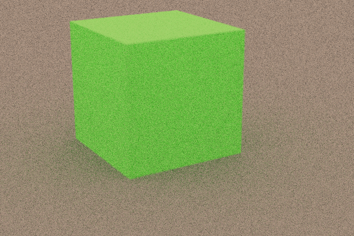

# Aeon Tracer

A C++ Ray Tracer.

Current features:
- ray traced meshes (triangular)
- ray traced spheres
- bitmap support
- materials (diffused, metal, dielectric)
- reflection/refraction
- physically-based camera
- ppm image output

