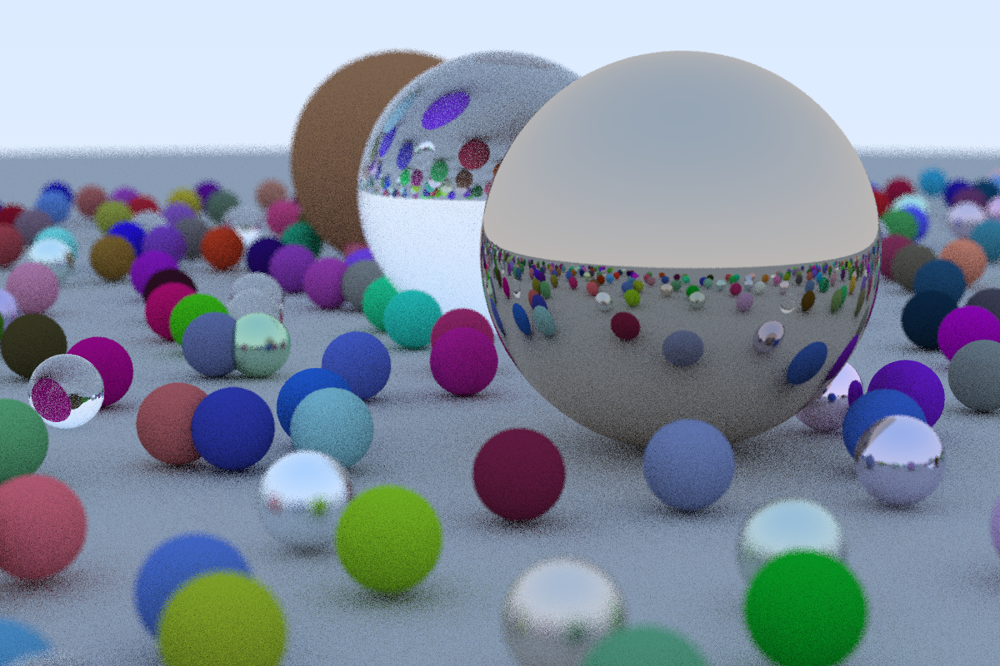

# cpu ray tracer



A CPU ray tracer, written in C++. I am writing this to validate my fundamentals in linear algebra and computer graphics from the ground up. I will continually update it with new features. I am documenting my process [here](/writeup/writeup.md). Based on Peter Shirley's ray tracing book.


Current features:
- ray traced spheres
- materials (diffused, metal, dielectric)
- reflection/refraction
- physically-based camera


### Running the ray tracer

To compile the ray tracer, run the following command:

``` 
g++ -std=c++11 main.cc -o raytracer 
```

To run the ray tracer, run the following command:

```
./raytracer > image.ppm
```

These commands are in tasks.json; to run them, press Ctrl+Shift+B in VS Code, then execute 'Build' and then 'Run'.