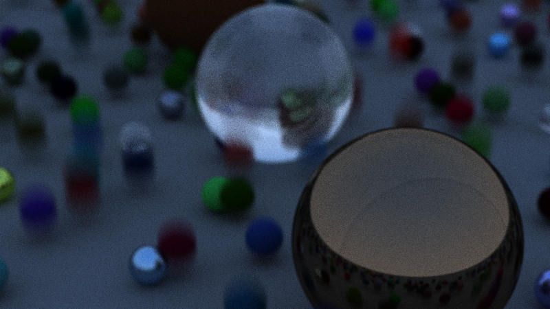
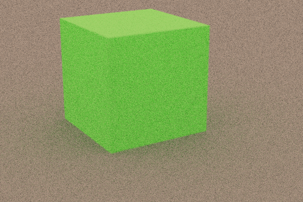

# Aeon Tracer

A C++ Ray Tracer.

Current features:
- Ray traced meshes (triangular)
- Ray traced spheres
- bitmap support
- materials (diffused, Metal, Dielectric)
- reflection/refraction
- physically-based Camera
- Bounded Volume Hierarchies for faster rendering
- ppm image output

